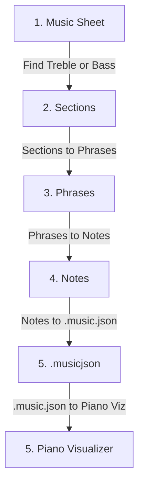

<h1>Sheets ETL Pipeline</h1>

```mermaid 
graph TD

A[1. Music Sheet] --> |Find Treble or Bass| B[2. Sections]
B --> |Sections to Phrases| C[3. Phrases]
C --> |Phrases to Notes| D[4. Notes]
D --> |Notes to .music.json| E[5. .musicjson]
E --> |.music.json to Piano Viz| F[5. Piano Visualizer]
```

